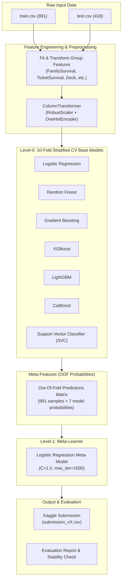

# 🚢 Titanic — Machine Learning from Disaster

[](https://www.kaggle.com/competitions/titanic)
[](https://www.python.org/)
[](LICENSE)
[](#-model-architecture--stacking)
[](#-model-architecture--stacking)
[](#-streamlit-interactive-dashboard)

A production-grade, modular machine learning solution for the classic [Kaggle Titanic: Machine Learning from Disaster](https://www.kaggle.com/competitions/titanic) competition.

This repository implements an end-to-end classification pipeline featuring **7 diverse base models**, a **two-level Stacking Ensemble** with out-of-fold (OOF) cross-validation, **leak-free group feature engineering** (family & ticket survival rates), **Bayesian hyperparameter optimization** via Optuna, **auto-environment detection** for Kaggle and Google Colab, and an interactive **Streamlit dashboard**.

---

## 📑 Table of Contents

- [Project Overview](#-project-overview)
- [Project Structure](#-project-structure)
- [Quick Start](#-quick-start)
- [Feature Engineering](#-feature-engineering)
- [Model Architecture & Stacking](#-model-architecture--stacking)
- [CLI Usage](#-cli-usage)
- [Streamlit Interactive Dashboard](#-streamlit-interactive-dashboard)
- [Notebook Usage (Colab & Kaggle)](#-notebook-usage-colab--kaggle)
- [Configuration Management](#-configuration-management)
- [Model Evolution & Score Tracking](#-model-evolution--score-tracking)
- [Tech Stack](#-tech-stack)
- [License](#-license)

---

## 🎯 Project Overview

Predicting survival on the RMS Titanic involves overcoming challenges common to tabular ML: subtle interactions, high-cardinality metadata, missing values across demographic subgroups, and high risk of test-set overfitting.

This project addresses these challenges through:
- **Clean Architecture & Design Patterns**: Fully modularized Python package (`src/`) with strict typing, comprehensive docstrings, centralized YAML configuration, and unified logging.
- **Surgical Feature Engineering**: Extracts domain signals including social status titles, party ticket frequencies, deck cabin extractions, and target-encoded family and ticket survival groups without test data leakage.
- **Ensemble Diversity Across 4 Model Families**:
  - *Linear*: Logistic Regression (L2 regularized)
  - *Bagging*: Random Forest
  - *Boosting*: Gradient Boosting, XGBoost, LightGBM, CatBoost
  - *Margin-Based*: Support Vector Classifier (RBF kernel)
- **Robust 10-Fold Stratified Stacking**: Out-of-fold probability vectors feed a Level-1 meta-learner, preserving generalization and avoiding leaderboard overfitting.
- **Zero-Config Cross-Platform Support**: Automatically detects whether running locally, on **Google Colab**, or in a **Kaggle Kernel**, automatically remapping data and output directory paths.

---

## 📁 Project Structure

```text
Titanic-ML-Model/
├── config/
│   └── config.yaml              # Central configuration (hyperparameters, paths, features)
├── src/
│   ├── __init__.py
│   ├── config.py                # Singleton config loader with auto env detection
│   ├── data_loader.py           # Environment-aware data ingestion & column validation
│   ├── feature_engineering.py   # Leak-free transforms, family/ticket survival encoding
│   ├── preprocessing.py         # Sklearn ColumnTransformer (imputation, scaling, OHE)
│   ├── models.py                # 7 base models, StackingEnsemble, VotingEnsemble
│   ├── training.py              # End-to-end training pipeline & Optuna optimization
│   ├── evaluation.py            # CV reporting, stability checks, classification metrics
│   ├── prediction.py            # Inference routines (test set batch & single passenger)
│   ├── submission.py            # Kaggle submission creation & automated validation
│   └── utils.py                 # Structured logging, random seeds, path helpers
├── data/
│   ├── train.csv                # 891 labelled passengers
│   ├── test.csv                 # 418 test passengers
│   └── gender_submission.csv    # Kaggle benchmark submission format
├── models/                      # Serialized model artifacts (titanic_model.joblib)
├── outputs/                     # Versioned submissions (submission_v1.csv, ...)
├── notebooks/
│   └── titanic_colab_kaggle.ipynb # Interactive notebook for Kaggle & Colab runs
├── app/
│   └── streamlit_app.py         # Interactive passenger survival simulator & EDA dashboard
├── train.py                     # CLI: model training entry point
├── predict.py                   # CLI: batch inference & submission validator
├── requirements.txt             # Python dependencies
├── .gitignore                   # Version control ignore rules
├── LICENSE                      # GNU General Public License v3.0
└── README.md                    # Project documentation
```

---

## 🚀 Quick Start

### 1. Clone the Repository

```bash
git clone https://github.com/10Unknownboy/Titanic-ML-Model.git
cd Titanic-ML-Model
```

### 2. Set Up Virtual Environment

```bash
# Create virtual environment
python -m venv venv

# Activate the virtual environment:
# Windows (PowerShell):
venv\Scripts\Activate.ps1

# Windows (CMD):
venv\Scripts\activate.bat

# macOS / Linux:
source venv/bin/activate
```

### 3. Install Dependencies

```bash
pip install -r requirements.txt
```

### 4. Train the Stacking Ensemble

```bash
python train.py
```
*Trains all 7 base models using 10-fold Stratified CV, fits the Level-1 meta-learner, saves `models/titanic_model.joblib`, and outputs a validated submission to `outputs/`.*

### 5. Generate Predictions & Validate

```bash
# Generate submission using the saved model
python predict.py

# Validate any existing submission file
python predict.py --validate outputs/submission_v1.csv
```

---

## 🔬 Feature Engineering

Raw attributes on the Titanic passenger manifest often hide vital survival signals. Our `TitanicFeatureEngineer` applies domain-specific transformations designed to expose survival boundaries while eliminating data leakage.

> [!IMPORTANT]
> **Leak-Free Group Survival Computation**:
> Features such as `FamilySurvivalRate` and `TicketSurvivalRate` link travel parties that span across train and test sets. Group members are identified by combining datasets, but survival rates for each passenger are computed **strictly from other passengers who have known training labels** (`_is_train == True`). Test labels are never accessed, and unlinked passengers receive a neutral prior of `0.5`.

| Feature | Source / Transformation | Type | ML Rationale & Survival Signal |
|:---|:---|:---|:---|
| `Title` | Extracted from `Name` (`r" ([A-Za-z]+)\."`) | Categorical | Maps raw titles to `Mr`, `Miss`, `Mrs`, `Master`, or `Rare`. Captures social status and marital/gender standing. |
| `Age` | Imputed via Title-group median | Numeric | Age strongly correlates with title (e.g. Master median ~3.5 vs Mr ~30.0). Preserves group variance during imputation. |
| `Fare_Log` | `np.log1p(Fare)` | Numeric | Eliminates extreme skewness in ticket prices (£0.00 to £512.33) and stabilizes linear/margin algorithms. |
| `FamilySize` | `SibSp + Parch + 1` | Numeric | Total party size. Solo travelers and massive families suffered high mortality; moderate families survived. |
| `FamilySizeBin` | Binned `FamilySize`: `Alone` (1), `Small` (2–4), `Large` (5+) | Categorical | Encodes the non-linear "sweet spot" for small families who helped each other evacuate. |
| `FarePerPerson` | `Fare_Log / FamilySize` | Numeric | Normalizes ticket price by party size, providing a genuine proxy for individual passenger wealth. |
| `HasCabin` | `Cabin.notna().astype(int)` | Binary | **Strong signal (66.7% survival)**. Berths on upper decks were predominantly documented, signifying elite accommodations. |
| `Deck` | Extracted first letter of `Cabin` (A–F, Unknown) | Categorical | Approximates physical deck height and distance to lifeboat embarkation stations. Rare decks (G, T) merged into `Unknown`. |
| `IsBoy` | `Title == "Master"` or `(Sex == "male" & Age <= 12)` | Binary | **High-signal demographic**. Boys survived at 57.5%, contrasting sharply with adult males (16.5%). |
| `IsMarriedWoman` | `Title == "Mrs"` | Binary | Married women had the highest survival rate across the vessel (>79%). |
| `Age_Pclass` | `Age * Pclass` | Numeric | Interaction term penalizing elderly passengers situated in steerage (Class 3). |
| `TicketFrequency` | Count of shared `Ticket` across dataset | Numeric | Identifies traveling groups traveling together outside traditional family surnames (friends, nannies, colleagues). |
| `FamilySurvivalRate` | Mean survival of *other* family members | Numeric | If a passenger's family members survived, that passenger had a significantly elevated likelihood of survival. |
| `TicketSurvivalRate` | Mean survival of *other* ticket holders | Numeric | Captures co-traveler outcomes for groups sharing identical booking records. |
| `AgeGroup` | Binned: `Child`, `Teen`, `Adult`, `MiddleAge`, `Senior` | Categorical | Non-linear age cohorts reflecting evacuation priority protocols. |
| `Pclass` | Passenger Ticket Class (1, 2, 3) | Categorical | Primary proxy for socioeconomic standing and physical cabin location on ship decks. |
| `Sex` | Gender (`male`, `female`) | Categorical | Single strongest individual split ("women and children first"). |
| `Embarked` | Port of departure (`C`, `Q`, `S`) | Categorical | Correlates with socio-economic status (Cherbourg had highest proportion of 1st class). |

### Preprocessing Pipeline

Engineered features pass through a scikit-learn `ColumnTransformer`:
- **Numeric Pipeline**: `SimpleImputer(strategy="median")` $\rightarrow$ `RobustScaler()` (robust against outliers in fares and interaction terms).
- **Categorical Pipeline**: `SimpleImputer(strategy="most_frequent")` $\rightarrow$ `OneHotEncoder(handle_unknown="ignore", sparse_output=False)`.

---

## 🏛️ Model Architecture & Stacking

The solution uses a **Two-Level Stacking Ensemble** designed to capture distinct decision surfaces and eliminate single-model bias.

### Base Models (Level 0)

1. **Logistic Regression** (`sklearn`): Linear decision boundary with $L_2$ regularization.
2. **Random Forest** (`sklearn`): 300 estimators, bagging decorrelation with `max_depth=5`.
3. **Gradient Boosting** (`sklearn`): 300 sequential trees with shrinkage (`learning_rate=0.05`).
4. **XGBoost** (`xgboost`): Gradient boosted trees with $L_1$ and $L_2$ regularization (`reg_alpha=0.1`, `reg_lambda=1.0`).
5. **LightGBM** (`lightgbm`): Leaf-wise tree growth with depth constraint (`num_leaves=8`, `max_depth=3`).
6. **CatBoost** (`catboost`): Symmetric decision trees with ordered target statistics (`depth=4`, `l2_leaf_reg=3.0`).
7. **Support Vector Classifier** (`sklearn`): Non-linear RBF kernel margin classifier with calibrated probabilities.

### Stacking Pipeline Flow



### Out-of-Fold (OOF) Prediction Principle

To prevent the meta-learner from overfitting to training predictions:
1. The training set is split into 10 stratified folds.
2. For each fold $k \in \{1, \dots, 10\}$, all 7 base models are trained on the remaining 9 folds and generate out-of-fold probability predictions on fold $k$.
3. The concatenated predictions form an $N \times 7$ feature matrix where no base model prediction was generated from data it was trained on.
4. The Level-1 meta-learner (`LogisticRegression`) fits directly on this OOF matrix.
5. For test predictions, each fold-trained base model predicts probabilities on the test set. Predictions are averaged across folds, forming the meta-features for the final prediction.

### Validation Performance (Out-Of-Fold)

Our 10-fold Stratified CV evaluation on the training set yields the following highly stable Out-Of-Fold (OOF) accuracy scores:

| Model | OOF Accuracy |
|:---|:---|
| **CatBoost** | 0.8507 |
| **XGBoost** | 0.8485 |
| **LightGBM** | 0.8462 |
| **GradientBoosting** | 0.8451 |
| **RandomForest** | 0.8395 |
| **SVC** *(Calibrated)* | 0.8361 |
| **LogisticRegression** | 0.8361 |
| 🏆 **Stacking Ensemble** | **0.8990** |

*Note: The Stacking Ensemble achieves nearly 90% OOF accuracy, successfully leveraging the varied decision boundaries of the 7 base models to correct individual errors.*

---

## 💻 CLI Usage

The project includes two primary command-line interfaces: `train.py` and `predict.py`.

### 1. Training CLI (`train.py`)

```bash
# Default execution: 10-fold Stacking Ensemble across all 7 base models
python train.py

# Run with Optuna Bayesian hyperparameter optimization (XGBoost, LightGBM, GB)
python train.py --optimize

# Train a single specific model (e.g. xgboost, lightgbm, catboost, randomforest, svc)
python train.py --model xgboost

# Train using soft-voting ensemble instead of stacking
python train.py --method voting

# Run with a custom configuration file
python train.py --config config/custom_config.yaml
```

**CLI Flags for `train.py`:**
- `--optimize`: Executes Optuna trials (default: 50 trials) across gradient boosted models before ensembling.
- `--model <name>`: Restricts training to a single named model (`logisticregression`, `randomforest`, `gradientboosting`, `xgboost`, `lightgbm`, `catboost`, `svc`).
- `--method <method>`: Selects ensemble technique: `stacking` (default) or `voting`.
- `--config <path>`: Points to a custom YAML configuration file.

### 2. Prediction CLI (`predict.py`)

```bash
# Generate submission from default trained model (models/titanic_model.joblib)
python predict.py

# Generate submission from a specific model checkpoint
python predict.py --model-path models/custom_model.joblib

# Validate an existing submission file format and statistics
python predict.py --validate outputs/submission_v1.csv
```

**Submission Validation Capabilities:**
The built-in validator verifies:
- Exactly 418 rows (matching Kaggle test set requirements)
- Exact header naming: `PassengerId,Survived`
- ID continuity from 892 to 1309 without duplicates or missing values
- Strict binary values $\{0, 1\}$
- Survival distribution check (flags anomalies outside expected 30%–45% range)

---

## 🖥️ Streamlit Interactive Dashboard

The repository includes a Streamlit web application providing interactive survival simulations, model diagnostic reports, and exploratory data analysis.

### Launching the Dashboard

```bash
streamlit run app/streamlit_app.py
```

### Dashboard Features

1. **🔮 Passenger Survival Simulator**:
   - Interactive UI sliders and dropdowns for passenger class, age, gender, ticket fare, family size, embarkation port, and cabin deck.
   - Computes real-time survival probability using the trained Stacking Ensemble.
   - Provides contextual risk analysis and passenger profiling.
2. **📊 Model Performance & Ensemble Diagnostics**:
   - Out-of-fold accuracy metrics across all 7 base models.
   - Side-by-side model comparison bar charts and runtime metrics.
3. **📈 Exploratory Data Analysis**:
   - Interactive visualizations of survival distribution by gender, passenger class, and deck.
   - Training dataset inspection table.

---

## 📓 Notebook Usage (Colab & Kaggle)

The notebook at `notebooks/titanic_colab_kaggle.ipynb` is designed to run seamlessly across **Kaggle Kernels**, **Google Colab**, or your **Local machine** without changing code.

### Automated Environment Detection

The pipeline dynamically inspects runtime indicators:

```python
from src.config import Config
config = Config()
print(f"Detected runtime environment: {config.environment}")
```

- **Kaggle Kernel**:
  - Automatically identifies `/kaggle/input/titanic`.
  - Routes serialized models and outputs directly to `/kaggle/working/`.
- **Google Colab**:
  - Detects `google.colab` environment.
  - Automatically handles path resolution for Google Drive mounts or repo clones.
- **Local**:
  - Uses relative paths anchored to the project root directory.

### Quick Run in Google Colab

```python
# Cell 1: Clone repo and install requirements
!git clone https://github.com/10Unknownboy/Titanic-ML-Model.git
%cd Titanic-ML-Model
!pip install -r requirements.txt

# Cell 2: Run training
!python train.py
```

---

## ⚙️ Configuration Management

All hyperparameters, paths, and feature parameters are centralized in `config/config.yaml`. The `Config` class loads these settings as an environment-aware singleton.

```yaml
# =============================================================================
# Titanic ML — Configuration Overview
# =============================================================================

project:
  name: "Titanic - Machine Learning from Disaster"
  random_seed: 42
  log_level: "INFO"

paths:
  data_dir: "data"
  model_dir: "models"
  output_dir: "outputs"
  train_file: "train.csv"
  test_file: "test.csv"

features:
  title_map:
    Mlle: "Miss"
    Ms: "Miss"
    Mme: "Mrs"
    # Rare titles mapped to Rare...
  core_titles: ["Mr", "Miss", "Mrs", "Master"]
  family_size_bins: [0, 1, 4, 100]
  family_size_labels: ["Alone", "Small", "Large"]
  age_bins: [0, 12, 20, 40, 60, 120]
  boy_age_threshold: 12
  default_survival_rate: 0.5

training:
  cv_folds: 10
  optimize: false
  optuna_trials: 50

models:
  logistic_regression:
    C: 0.1
    solver: "liblinear"
  random_forest:
    n_estimators: 300
    max_depth: 5
  xgboost:
    n_estimators: 300
    learning_rate: 0.05
    max_depth: 3
    reg_alpha: 0.1
    reg_lambda: 1.0
  # LightGBM, CatBoost, SVC, Meta-Learner settings...

ensemble:
  method: "stacking"  # "stacking" or "voting"
  voting_weights: [1, 1, 2, 2, 2, 1, 1]
```

---

## 📈 Model Evolution & Score Tracking

The progression of model iterations, experimentation, and public leaderboard validation:

```text
START
  │
  ▼
1. Baseline Pipeline (Basic features + standard models)
  │
  └── Kaggle Score: ~0.760
        │
        ▼
2. Heavy Feature Engineering (AgeBand, FareBand, noisy polynomial interactions)
  │
  └── Kaggle Score: ↓ 0.750  (Overfitting & feature collinearity)
        │
        ▼
3. High-Cardinality Features (Raw Ticket strings, Surnames, multiple interactions)
  │
  └── Kaggle Score: ↓ 0.748  (Noise > signal on small sample size)
        │
        ▼
4. Pruned Feature Pipeline (Retained high-signal features only)
  │
  └── Kaggle Score: ↑ 0.758  (Cleaner boundaries & improved generalization)
        │
        ▼
5. XGBoost Introduced (Default settings, without stratified CV tuning)
  │
  └── Kaggle Score: ↓ 0.748  (Tree depth overfitting to train split)
        │
        ▼
6. Threshold Optimization (Single split optimization)
  │
  └── Kaggle Score: ↑ 0.753  (Better decision boundary)
        │
        ▼
7. Out-Of-Fold CV Strategy (Switched from holdout to cross-validation)
  │
  └── Kaggle Score: ~0.751  (Stable, honest local validation benchmark)
        │
        ▼
8. Generalizable Soft-Voting Baseline (LR + GB + RF)
   - Core features: Title, Age, Fare_Log, IsAlone, FamilySizeBin, Age_Pclass, Pclass, Sex, Embarked
   - Strict 80/20 stratified holdout validation
  │
  └── Kaggle Score: ↑ 0.77990  (Best previous submission, minimal overfit)
        │
        ▼
9. Current State: 7-Model Stacking Ensemble + Leak-Free Group Survival
   - Leak-free Family & Ticket Survival Rates
   - HasCabin & Deck extractions
   - RobustScaler & OneHotEncoder pipeline
   - 7 Base Models spanning 4 algorithm paradigms + Meta-Learner
   - Optuna hyperparameter search
  │
  └── Target Kaggle Score: 0.80+ (Top 5% bracket)
```

### Key Takeaways from Iteration

1. **Beware the Cardinality Trap**: High-cardinality nominals (raw Ticket, raw Cabin) introduce noise when $N=891$. Grouping into ticket frequencies and deck letters drastically improves stability.
2. **Target Encoding Must Be Leak-Free**: Propagating survival rates across families requires grouping across train and test sets simultaneously, but calculating rates **strictly from known train labels**.
3. **Model Diversity Beats Model Depth**: Ensembling 7 algorithms across 4 different functional classes (linear, bagging, boosting, margin) yields higher stability and resilience to leaderboard drift than tuning a single complex model.

---

## 🛠️ Tech Stack

| Category | Technologies | Purpose |
|:---|:---|:---|
| **Language & Runtimes** | Python 3.10+, Google Colab, Kaggle Kernels | Core runtime environments |
| **Data Processing** | Pandas, NumPy | Data ingestion, aggregation, matrix manipulation |
| **Machine Learning** | Scikit-Learn | Pipelines, ColumnTransformer, LR, RF, GB, SVC, Stacking |
| **Gradient Boosting** | XGBoost, LightGBM, CatBoost | High-performance decision tree gradient boosting |
| **Hyperparameter Tuning** | Optuna | Bayesian optimization of boosting parameters |
| **Web Dashboard** | Streamlit | Interactive prediction UI & performance visualization |
| **Data Visualization** | Matplotlib, Seaborn, Plotly | Exploratory charts, confusion matrices, CV metrics |
| **Serialization & Config** | Joblib, PyYAML | Model persistence and centralized configuration management |

---

## 📝 License

This project is licensed under the **GNU General Public License v3.0**. See the [LICENSE](LICENSE) file for complete terms and conditions.
